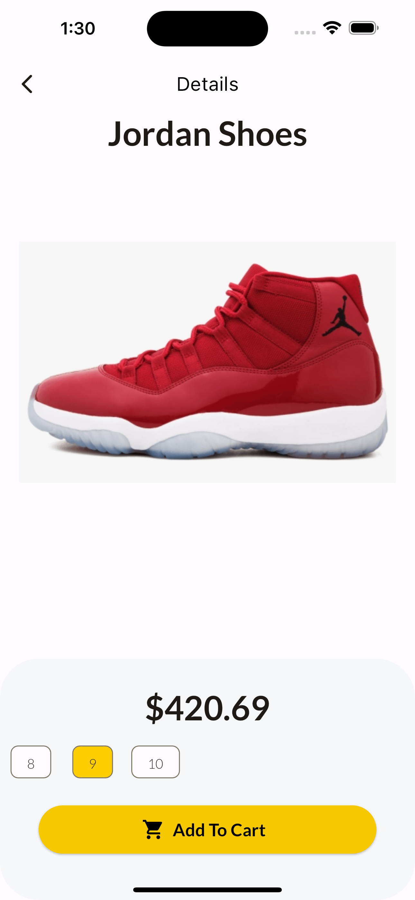
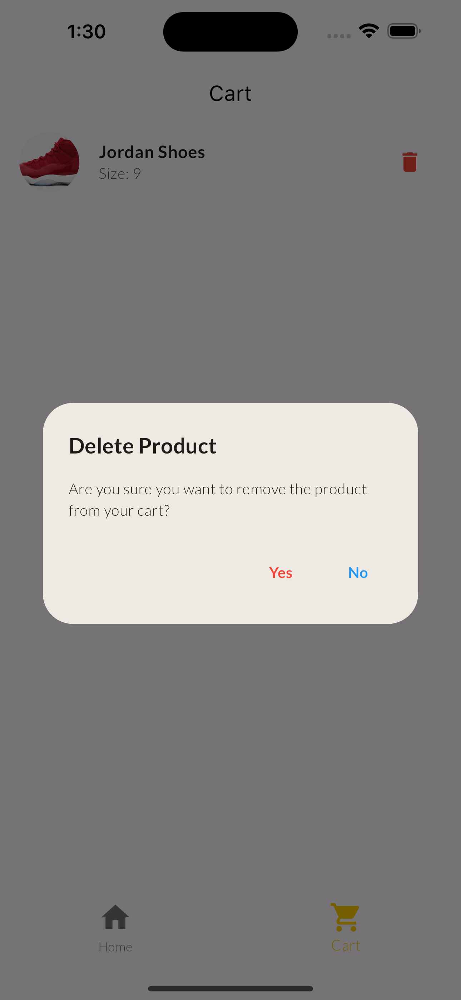

# Shopping App

A Flutter-based mobile application for shopping, featuring a user-friendly interface for browsing products and managing a shopping cart.

## Features

- View a list of available products
- Filter products by category
- Search for specific products
- View product details including price, image, and available sizes
- Add products to the shopping cart
- Remove products from the shopping cart
- Responsive design for various screen sizes

## Screenshots

<div style="display: flex; justify-content: space-between;">
  
  
  
</div>

## Installation

To run this app locally on your machine, follow these steps:

1. **Clone Repository**: Clone this repository to your local machine using the following command:

    ```
    git clone https://github.com/aryanbhardwaj24/shopping_app.git
    ```


2. **Navigate to Directory**: Change into the project directory:


    ```
    cd shopping_app
    ```


3. **Install Dependencies**: Install required dependencies using the Flutter package manager:


    ```
    flutter pub get
    ```


4. **Run the App**: Launch the app on your local device or simulator:


    ```
    flutter run
    ```

## Dependencies

This project uses the following dependencies:

- [provider](https://pub.dev/packages/provider) - State management library for managing the shopping cart state.
- [flutter](https://flutter.dev/) - Flutter SDK for building cross-platform applications.
- [flutter/material.dart](https://api.flutter.dev/flutter/material/material-library.html) - Flutter's material design widgets for building UI components.

## License

This project is licensed under the MIT License - see the [LICENSE](LICENSE) file for details.

## Author

[Aryan Bhardwaj](https://github.com/aryanbhardwaj24)